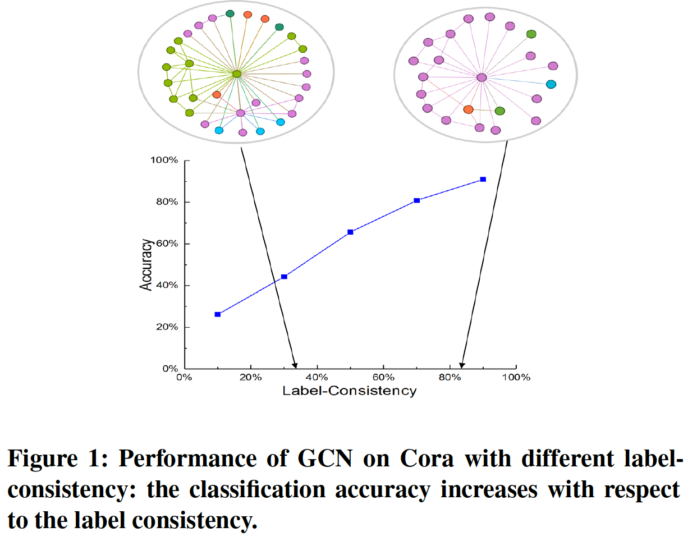

## Label-Consistency based Graph Neural Networks for Semi-supervised Node Classification
> Label-Consistency based Graph Neural Networks for Semi-supervised Node Classification. SIGIR(short paper), 2020. 

## Overview

 

> We provide a TensorFlow implementation of LCGNN. Graph neural networks (GNNs) achieve remarkable success in graphbased semi-supervised node classification, leveraging the information from neighboring nodes to improve the representation learning of target node. The success of GNNs at node classification depends on the assumption that connected nodes tend to have the same label. However, such an assumption does not always work, limiting the performance of GNNs at node classification. We propose label-consistency based graph neural network (LC-GNN), leveraging node pairs unconnected but with the same labels to enlarge the receptive field of nodes in GNNs. 

## Requirements
the script has been tested running under Python 3.7, with the following packages installed (along with their dependencies):
* torch
* torch_geometric
* numpy
* scipy

## Run the LCGCN
* cd gcn_run
* python lcgcn_ld.py

## Run the LCGAT
* cd gat_run
* python lcgcn_ld.py

## Parameters
* --lambda2                 FLOAT         weight of regulariztion loss.         

## Acknowledgement

> We implement our model based on torch_geometric
